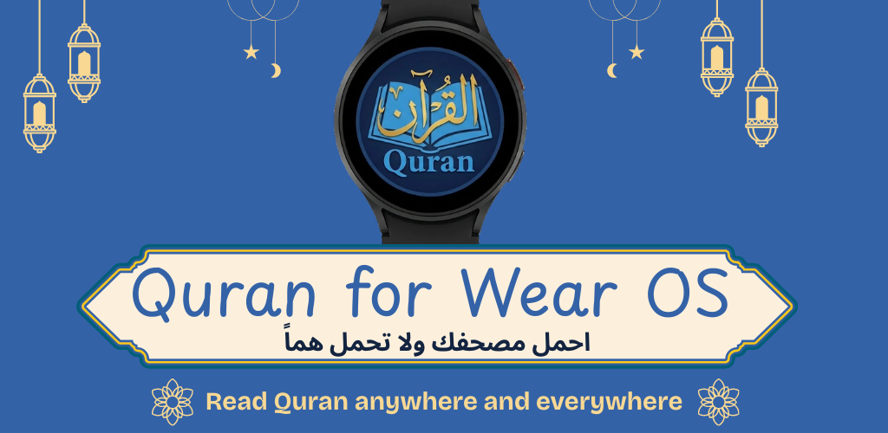
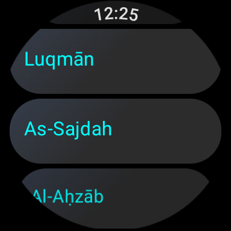
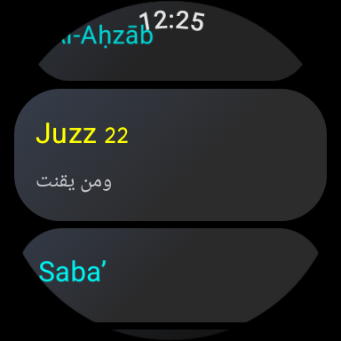
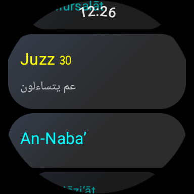
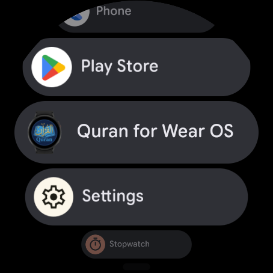
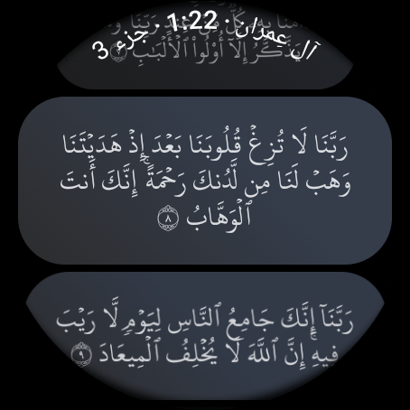
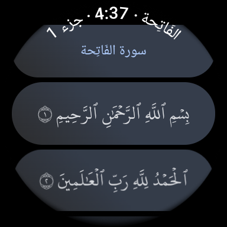
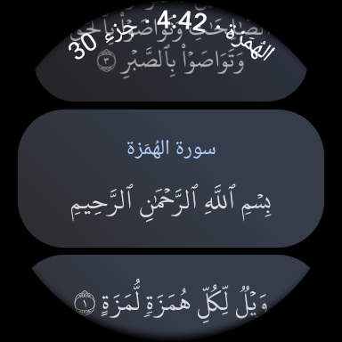
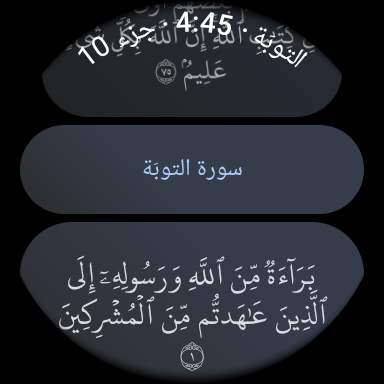

# Quran for Wear OS

This repository contains the code of **Quran4WearOS**, the only opensource Quran app for Android smartwatches.

## Some Screenshots

## Official Website
https://quran4wearos.app/

## Join us
If you want to share the reward, please join us.

* Join our Google group by sending an empty email to [quran-for-wear-os+subscribe@googlegroups.com](mailto:quran-for-wear-os+subscribe@googlegroups.com)
* Join the test team:
  * Using Google Play on Android go to https://play.google.com/store/apps/details?id=app.quran4wearos
  * From the Web Browser go to https://play.google.com/apps/testing/app.quran4wearos

## Acknowledgment
The data (Quranic text and Uthmani Hafs font) is obtained from [King Fahd Quran printing complex](https://qurancomplex.gov.sa/)
